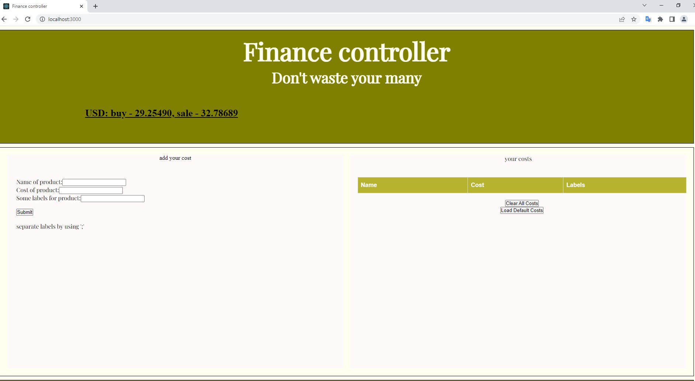
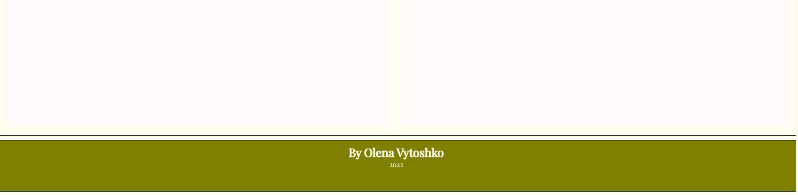
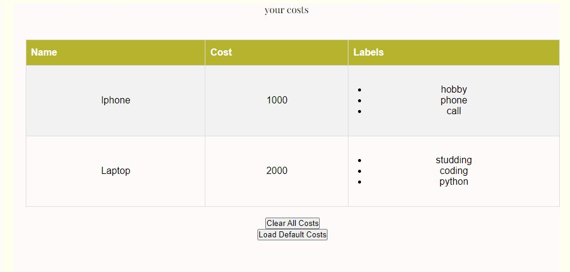

## Finance controller
This is app for writing and saving your costs. You write the product name, cost and some labels(like studying, for my car and others).


## The main page



### List of costs


You can:
* add new cost
* clear all costs
* load default costs from server
* see the current exchange rate for dollars at the PrivatBank

## Front End

The page consists of 3 Components:
* Header
* Article
* Footer

The Article consists of From for cost and List for costs.

Exchange rate was gotten from PrivatBank by using `axios` library.

Unfortunately the points of registration and login at the Front End were not implemented ((

## Back End

* using nodejs
* for authorization the MongoDB is used
* implements the API:
  * "/" - just sending `hello world` string
  * "/costs" - sending default costs from the resources
  * "/register" - registration the new user
  * "/login" - log in user

I used mongoDB by docker by the command:
```bash
docker run --name mongodb -d -p 27017:27017 -e MONGO_INITDB_ROOT_USERNAME=admin -e MONGO_INITDB_ROOT_PASSWORD=admin mongo
```

Unfortunately the points of saving data for each user were not implemented ((

---
The code of front end without react contains at the `lab2` folder  
